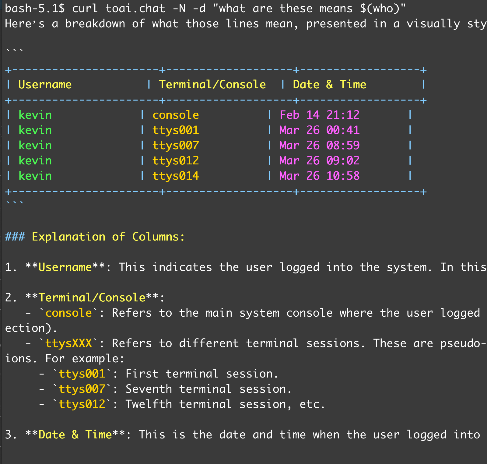
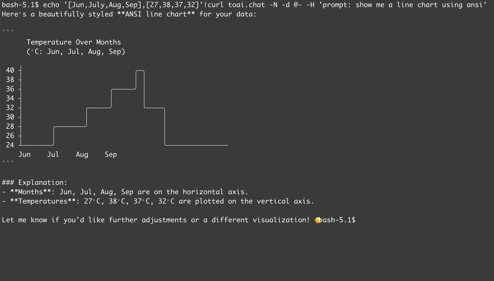

# Toai.chat 🚀

Toai.chat is a command-line AI interaction tool that enables seamless communication and interaction with large language models, eliminating the need for local AI client installations. By leveraging simple `curl` commands, users can harness powerful AI capabilities directly within their terminal environment.

### ✨ Key Features

- **Zero-Setup Deployment**: Operates without requiring the installation of additional AI client software.
- **Intuitive Interface**: Facilitates rapid dialogue initiation through straightforward `curl` commands.
- **Versatile Model Compatibility**: Supports a wide array of large language models.
- **Customizable Prompt Engineering**: Allows users to define custom system prompts, tailoring AI behavior to specific roles.
- **Integrated File Handling**: Supports the uploading of files for AI-driven processing tasks.
- **Real-Time Output Streaming**: Provides immediate display of AI responses, eliminating wait times for complete generation.

### 🛠️ Usage Tips

+ Use a simple command line

    ```shell
    $ curl toai.chat -N -d "what are these means $(who)"
    ```
    

+ Slightly more complex command lines
    ```
    $ cat esmb.py | curl toaichat -N -d @- -H
    ```
    

    ```
    echo '[Jun,July,Aug,Sep],[27,38,37,32]'|curl toai.chat -N -d @- -H 'prompt: show me a line chart using ansi' 
    ```
    

### Parameters
+ Here's a summary of the parameters you might use, along with some tips:

    | Command | Description |
    |---|---|
    | `-N` or `--no-buffering` | Disable curl's buffering to enable streaming output |
    | `-d` | Specify the prompt you want to send |
    | `-F'image=@file'` | Upload a file to AI |
    | `-F'model=deepseek-r1'` | Choose the model to use |
    | `-F'prompt=something'` | When using `-F`, you must use `-F'prompt='` to specify the prompt |
    | `-F'sp=you are Querky'` | Use a custom system prompt |
    | `-H'sp:you good at ascii art'` | Same as `-F'sp='`, used to set the system prompt |
    | `-H'model:phi'` | Same as `-F'model='`, used to select the model |

+ Todo:
    - [ ]  MCPServer Support (I've complained about the MCP protocol many times)
    - [x]  Intelligent Agent Role System (Already available but still in testing, hidden from you - -)
    - [x]  Plug-in RAG (Also in testing, do you believe it?!)

### ⚙️ Advanced Usage

#### 🎨 Customize AI Roles

You can customize the AI's system prompt by using the `-F'sp='` or `-H'sp:'` parameters to tailor the AI's role.

```shell
curl toai.chat -N -H'sp: You are a humorous comedian' -d "Tell a joke"
```

#### 🖼️ Upload Images

You can upload local images to AI for image-related processing using the `-F'image=@file'` parameter.

```shell
curl toai.chat -N -F'image=@/path/to/image.jpg' -F "prompt=Describe this image"
```

#### 🧠 Select Models

You can select different AI models using the `-F'model='` or `-H'model:'` parameters.

```shell
curl toai.chat -N -F'model=gpt-4' -F "prompt=Explain quantum mechanics"
```

### 📝 Examples

Here are some examples showcasing the powerful capabilities of Toai.chat.

1.  **Basic Conversation**

    ```shell
    curl toai.chat -N -d "Hello, who are you?"
    ```

2.  **Translation**

    ```shell
    curl toai.chat -N -H'sp: You are a translation engine' -d "Translate 'hello world' into Chinese"
    ```

3.  **Code Generation**

    ```shell
    curl toai.chat -N -H'sp: You are a Python programming assistant' -d "Write a function to calculate the Fibonacci sequence"
    ```

### 🤝 Contribution
Thanks to Pollinations.AI for the underlying technical support!!!
Welcome to participate in the development of Toai.chat! If you have any suggestions or comments, please send me an email: kevin#kevin1986.com
