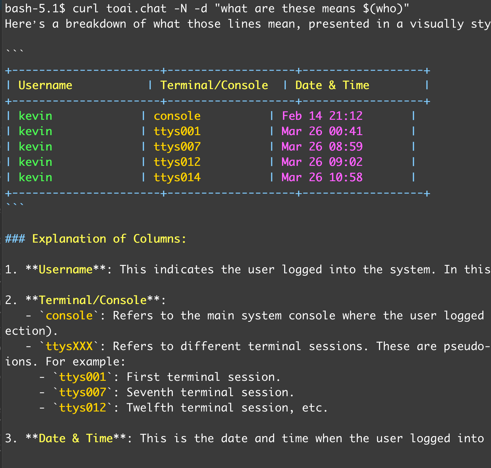

# Toai.chat 🚀

Toai.chat 是一个命令行下的 AI 交互工具，无需安装任何 AI 客户端，即可轻松与大型语言模型进行沟通和交流。通过简单的 `curl` 命令，即可在终端中体验强大的 AI 功能。

### ✨ 特性

- **零配置**：无需安装额外的 AI 客户端。
- **易于使用**：通过 `curl` 命令快速发起对话。
- **多模型支持**：支持多种大型语言模型。
- **自定义提示词**：可自定义系统提示词，定制 AI 角色。
- **文件上传**：支持上传文件到 AI 进行处理。
- **流式输出**：实时显示 AI 的回复，无需等待完整生成。

### 🛠️ 使用技巧

+ 使用简单的命令行

    ```shell
    $ curl toai.chat -N -d "what are these means $(who)"
    ```
    


+ 稍微复杂一点的命令行
    ```
    $ cat esmb.py | curl toaichat -N -d @- -H
    ```
    

    ```
    echo '[Jun,July,Aug,Sep],[27,38,37,32]'|curl toai.chat -N -d @- -H 'prompt: show me a line chart using ansi' 
    ```
    


### 参数
+ 整理一下可能用到的参数，大概给一些提示
    | Command | Description |
    |---|---|
    | `-N` 或 `--no-buffering` | 禁用 curl 的缓冲，实现流式输出 |
    | `-d` | 指定要发送的提示词（prompt） |
    | `-F'image=@file'` | 上传文件到 AI |
    | `-F'model=deepseek-r1'` | 选择使用的模型 |
    | `-F'prompt=something'` | 使用 `-F` 时，必须使用 `-F'prompt='` 指定提示词 |
    | `-F'sp=you are Querky'` | 使用自定义系统提示词 |
    | `-H'sp:you good at ascii art'` | 与 `-F'sp='` 相同，用于设置系统提示词 |
    | `-H'model:phi'` | 与 `-F'model='` 相同，用于选择模型 |

+ Todo:
    - [ ]  MCPServer的支持 ( 我吐槽过很多次MCP的协议了 )
    - [x]  智能体角色系统 ( 已经有了还在测试，藏起来不给你们用 - - )
    - [x]  外挂式RAG (也在测试，你信吗？！)
    
    

### ⚙️ 高级用法

#### 🎨 自定义 AI 角色

通过 `-F'sp='` 或 `-H'sp:'` 参数，可以自定义 AI 的系统提示词，从而定制 AI 的角色。

```shell
curl toai.chat -N -H'sp:你是一个幽默的段子手' -d "讲个笑话"
```

#### 🖼️ 上传图片

通过 `-F'image=@file'` 参数，可以将本地图片上传到 AI，进行图像相关的处理。

```shell
curl toai.chat -N -F'image=@/path/to/image.jpg' -F "prompt=描述这张图片"
```

#### 🧠 选择模型

通过 `-F'model='` 或 `-H'model:'` 参数，可以选择使用不同的 AI 模型。

```shell
curl toai.chat -N -F'model=gpt-4' -F "prompt=解释一下量子力学"
```

### 📝 示例

以下是一些使用示例，展示了 Toai.chat 的强大功能。

1.  **基本对话**

    ```shell
    curl toai.chat -N -d "你好，你是谁？"
    ```

2.  **翻译**

    ```shell
    curl toai.chat -N -H'sp: 你是一个翻译引擎' -d "将 'hello world' 翻译成中文"
    ```

3.  **代码生成**

    ```shell
    curl toai.chat -N -H'sp: 你是一个 Python 编程助手' -d "写一个计算斐波那契数列的函数"
    ```

### 🤝 贡献
感谢 Pollinations.AI 的底层技术支持！！！
欢迎参与 Toai.chat 的开发！如果你有任何建议或意见，请给我发邮件: kevin#kevin1986.com
